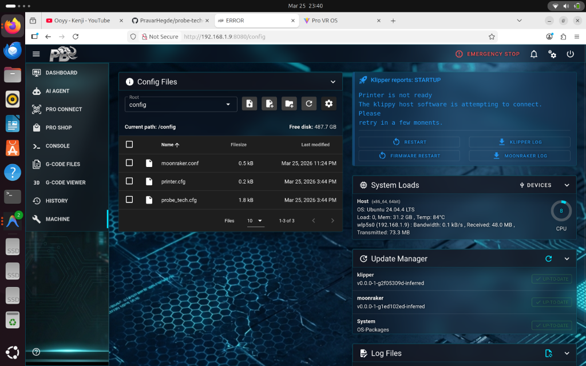

<p align="center">
  <a>
    
    <h1 align="center">Probe Tech Control v3.2.9</h1>
  </a>
</p>
<p align="center">
  The highly autonomous, AI-driven 3D Printer manufacturing orchestrator and control interface.
</p>

## ✨ The AI Manufacturing Ecosystem

Probe Tech Control has evolved beyond a basic web interface. The `v3.2.9` milestone introduces the **MK1 Autonomous Agent** ecosystem.

- **Native Model Context Protocol (MCP)**: Probe Tech directly broadcasts an SSE-compatible FastMCP server (`<ip>:8255/mcp/sse`), granting instant tool-calling capabilities (historical telemetry, hardware margin analysis) to any external AI like Claude or Cursor.
- **Conversational Machine Orchestration**: Manage your AI API keys and system configurations using pure Natural Language perfectly securely inside the local chat terminal without navigating cumbersome UI menus.
- **Built-in MK1 Integration**: Probe Tech Control now ships natively mapped with an autonomous Python backend proxy. It intelligently proxies AI commands, fetches Moonraker states instantly, and coordinates local Ollama models gracefully.
- **Zero-Friction UI**: A completely unified tab layout spanning Installed Agents, Model Marketplaces, and seamless Custom Links.

<p align="center">
  
</p>

## 🚀 Pro-Bharath Roadmap & Future Vision

We are architecting a complete end-to-end 3D design and manufacturing lifecycle system, designed to seamlessly dock with **probharath.com**.

The ultimate goal of this ecosystem is to convert standard desktop 3D printers into autonomous, profit-generating manufacturing nodes:
1. **Cloud-Synced Asset Marketplace**: Users will download pre-sliced models directly from the Pro-Bharath cloud via the agent interface natively.
2. **Autonomous Downtime Harvesting**: When your printer is idling dynamically, your AI Agent will automatically fetch external commercial orders from the cloud, schedule them effectively, and print them entirely autonomously while you are away. 
3. **Deep Print Cost/Margin Analysis**: Constant, real-time AI computer vision evaluations monitoring filament pricing and print duration vs. retail value.

## 📦 Installation Guide

Choose the method that best suits your needs:

### Option 1: Quick Install (Recommended)
Run this single command to download and install automatically (Lightweight):
```bash
wget -O - https://raw.githubusercontent.com/PravarHegde/probe-tech-control/master/probetech.sh | bash
```
*Supports seamless auto-installation on fresh systems.*

### Option 2: Docker Installation
For a clean, containerized instance connected securely across your network, see our advanced docker workflows:
👉 **[View the Docker Installation Guide](INSTALL.md)**

### Option 3: Manual / Developer Install
If you prefer to clone the repository manually:
```bash
git clone https://github.com/PravarHegde/probe-tech-control ptc
cd ptc
chmod +x install.sh
./install.sh
```

### Option 4: Fresh Re-Install (Troubleshooting)
If you have a broken installation and want to start fresh:

**A) Quick Fresh Start (Recommended):**
```bash
cd ~ && rm -rf ptc ptc_installer probe-tech-control && wget -O - https://raw.githubusercontent.com/PravarHegde/probe-tech-control/master/probetech.sh | bash
```

**B) Manual Fresh Start (Developer):**
```bash
cd ~ && rm -rf ptc ptc_installer probe-tech-control && git clone https://github.com/PravarHegde/probe-tech-control ptc && cd ptc && chmod +x install.sh && ./install.sh
```

### Advanced Documentation
For detailed manual configuration, requirements, and advanced setups, please refer to the:
👉 **[INSTALL.md](INSTALL.md)**

## 🛠 Help and Support

If you find a bug or have a feature request, please create an [Issue](https://github.com/PravarHegde/probe-tech-control/issues).

---
*Probe Tech Control is evolving towards full manufacturing autonomy. Special thanks to the original authors and the Klipper community.*
